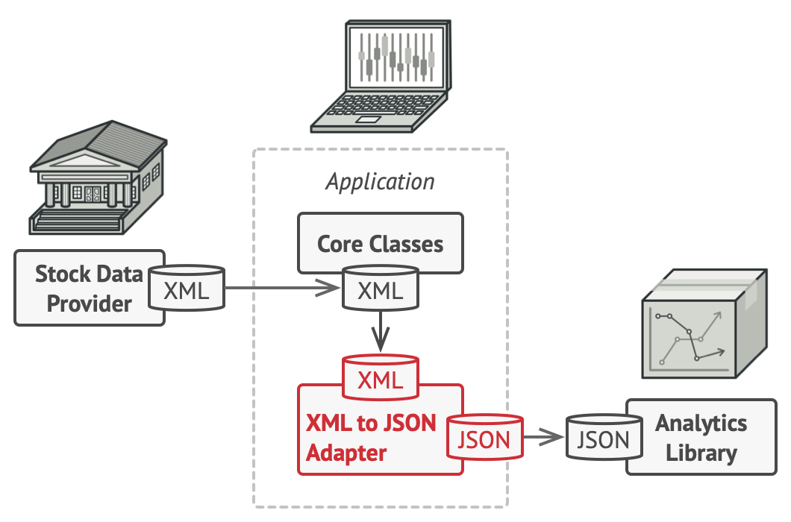

# Design Patterns
A design pattern provides a general reusable solution for the common problems that occur in software design. The pattern typically shows relationships and interactions between classes or objects

### Types of Design pattern
There are mainly three types of design patterns:  
1. **Creational**: These design patterns are all about class instantiation or object creation e.g. _Factory Method, Abstract Factory, Builder, Singleton, Object Pool, and Prototype._
   * _class-creation patterns_: use inheritance effectively.
   * _object-creation patterns_: use delegation effectively.   
2. **Structural**: These design patterns are about organizing different classes and objects to form larger structures and provide new functionality. With structural patterns, you can add functionalities to objects so that restructuring some parts of the system does not affect the rest. e.g. _Adapter, Bridge, Composite, Decorator, Facade, Flyweight, Private Class Data, and Proxy_
3. **Behavioral**: These design patterns are about identifying common communication patterns between objects and realizing these patterns. In short, behavioral design patterns are concerns with the responsibilities between objects by outlining the patterns for communication between objects. e.g. _Chain of responsibility, Command, Interpreter, Iterator, Mediator, Memento, Null Object, Observer, State, Strategy, Template method, Visitor_

Reference: [https://www.geeksforgeeks.org/design-patterns-set-1-introduction/](https://www.geeksforgeeks.org/design-patterns-set-1-introduction/)


## Creational Design Patterns
### Factory Method
In the Factory Method pattern, we create objects without exposing the creation logic to the client and the client uses the same common interface to create a new type of object.  
```java
enum VehicleType {
    VT_TwoWheeler,
    VT_ThreeWheeler,
    VT_FourWheeler
}

class Vehicle {
    ...
    // The creation logic is not exposed to the client
    // Client uses the common interface to create new objects
    static Vehicle createVehicle(VehicleType type) {...}
    ...
}
class TwoWheeler extends Vehicle {...}
class ThreeWheeler extends Vehicle {...}
class FourWheeler extends Vehicle {...}
```

### Abstract Factor Method
Abstract Factory provides interfaces for creating families of related or dependent objects without specifying their concrete classes.
```java
enum LocationType{
    LT_INDIA
    LT_USA
    ...
}

class VehicleFactory{
    ...
    // interface for creating families of related objects
    // without specifying the concrete class
    static Vehicle(VehicleType vt) {
        // get location from somewhere
        ...
    }
    ...
}

class IndiaFactory { ... }
class USAFactor { ... }
```

### Builder Design Pattern
This design pattern separates the construction of a complex object from its representation so that the same construction process can create different representations.

```java
interface House{ ... }
// The end product
class NormalHouse implements House { ... }
class LuxuryHouse implements House { ... }

interface HouseBuilder { ... }
// ConcreteBuilders
class IglooHouseBuilder implements HouseBuilder { ... }
class TipiHouseBuilder implements HouseBuilder { ...}

// Builder which can be used to build house
class CivilEngineer {
    ...
    HouseBuilder houseBuilder;
    ...
}
```


### Singleton Design Pattern
This design pattern restricts the instantiation of a class to one object e.g. single DB connection, single configuration object, etc.
```java
class Singleton{
    // the only instance of the class (Early initialization - object created at load time)
    // we can also use lazy-initialization if it's expensive (further double-check for thread synchronization)
    private static Singleton obj = new Singleton();
    // Constructor should be private so that users cannot create objects
    private Singleton(){ }
    // A static method to get the only instance of the class
    public static Singleton getInstance() { return obj; }
}
```

### Prototype Design Pattern
The prototype model is used mainly for creating objects in performance-intensive situations. The concept is to copy an existing object rather than creating a new instance from scratch where existing object acts as a prototype.


## Structural Design Pattern
### Adapter Pattern
The adapter pattern convert the interface of a class into another interface clients expect. Adapter lets classes work together that couldn’t otherwise because of incompatible interfaces.


### Bridge Pattern
The Bridge design pattern allows you to separate the abstraction from the implementation. The bridge pattern says `prefer composition over inheritance`.   
|Without bridge pattern|With bridge pattern|
|---|---|
|||

### Composite Pattern
This design pattern lets you compose objects into tree structures and then work with these structures as if they were individual objects.  


### Decorator Pattern
The decorator pattern attaches additional responsibilities to an object dynamically. Decorators provide a flexible alternative to subclassing for extending functionality.


### Facade Pattern
This pattern hides complexities of the system and provides a simple interface to the client from where the client can access the system.   
For example consider a hotel with multiple restaurants. Suppose you as a client want to get menu of a particular resturant then you can simply ask the staff to get it for you and the staff will do the complicated task of retrieving the correct menu out of multiple resturants; here staff is acting as facade who is hiding the complexities presenting you a simple way to interact with the system.

### Flyweight Pattern
In Flyweight pattern we create `immutable` objects and re-use them instead of creating new object every time. For example characters in a document, same character object can be used for all occurrences.

### Proxy Pattern
This pattern lets you provide a substitute or placeholder for another object. For example a cheque a proxy for cash.   
There are few differences between the related patterns. Like Adapter pattern gives a different interface to its subject, while Proxy patterns provides the same interface from the original object but the decorator provides an enhanced interface. Decorator pattern adds additional behaviour at runtime.


## Behavioral Design Patterns
### Chain of Responsibility Pattern
Chain of responsibility pattern is used to achieve loose coupling in software design where a request from the client is passed to a chain of objects to process them. For example middleware.

### Command Pattern
In command pattern we use an object to encapsulate all information needed to perform an action or trigger an event at a later time. 

### Iterator Pattern
The iterator pattern provides a way to access the elements of an aggregate object without exposing its underlying representation.  
```java
// Create an iterator
Iterator iterator = collection.createIterator();

// It wouldn’t matter if collection is Array or ArrayList or
// anything else.
while (iterator.hasNext()){
    // how item is accessed is not exposed
    Item item = iterator.next());
}
```


### Observer Pattern
The Observer Pattern defines a one to many dependency between objects so that one object changes state, all of its dependents are notified and updated automatically e.g. email subsciptions, event listeners, etc.

#### Advantages
- Subject only knows that observer implement Observer interface.Nothing more.
- There is no need to modify Subject to add or remove observers.
- We can reuse subject and observer classes independently of each other.
