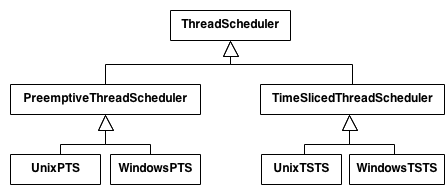

# Design Patterns in JavaScript
This doc serves the purpose of summary notes from the Udemy course [Design Patterns in JavaScript](https://www.udemy.com/course/design-patterns-javascript/)  


**What are design patterns?**  
In software engineering, a software design pattern is a general, reusable solution to a commonly occurring problem within a given context in software design.  


### SOLID PRINCIPLES
**What are SOLID principles?**  
In software engineering, SOLID is a mnemonic acronym for five design principles intended to make object-oriented designs more understandable, flexible, and maintainable.  
1. _**S**ingle Responsibility Principle_: A class should have only one reason to change meaning that it should have only one responsibility.
2. _**O**pen-Closed Principle_: Software entities (classes, modules, functions, etc.) should be open for extension, but closed for modification.
3. _**L**iskov Substitution Principle_: Objects in a program should be replaceable with instances of their subtypes without altering the correctness of that program.
4. _**I**nterface Segregation Principle_: No client should be forced to depend on methods it does not use. Many client-specific interfaces are better than one general-purpose interface. 
5. _**D**ependency Inversion Principle_: High-level modules should not depend on low-level modules. Depend upon abstractions. Do not depend upon concrete classes.

### Gamma Categorization
Design patterns are typically split into three categories:   
1. _Creational Pattern_: These design patterns are all about class instantiation or object creation.
2. _Structural Pattern_: These design patterns are about organizing different classes and objects to form larger structures and provide new functionality. 
3. _Behavioral Pattern_: These design patterns concerns with the responsibilities between objects by outlining the patterns for communication between objects. 

### Creational Design Patterns
**Builder Pattern**:   
Builder pattern is used to create complex objects with constituent parts that must be created in the same order or using a specific algorithm.  
- A builder is a separate component for building an object.
- We can either give builder an initializer or return it via static function.
- To make builder fluent, _return this_
- Different facets of an object can be built with different builders working in tandem via a base class.  

**Factory Pattern**  
The factory pattern is used to replace class constructors, abstracting the process of object generation so that the type of the object instantiated can be determined at run-time. In short, the factory pattern is used to create objects without having to specify the exact class of the object that will be created.  

**Abstract Factory Pattern**   
Abstract Factory Pattern is a creational design pattern that lets you produce families of related objects without specifying their concrete classes. Here you create a factory for each item and put all factories in a single class (AbstractFactory - factory of factories).  

**Prototype Pattern**  
The prototype pattern is used to instantiate a new object by copying all of the properties of an existing object creating an independent clone. This practise is particularly useful when the construction of a new object is inefficient.  

**Singleton Pattern**  
The Singleton Pattern is a design pattern that restricts the instantiation of a class to one object. The Singleton Pattern is used in situations where it is important to have only one instance of a class and where creation of object is expensive for example a database connection.  

### Structural Design Pattern
**Adapter Pattern**
The Adapter Pattern allows objects with incompatible interfaces to collaborate. The Adapter pattern converts the interface of a class into another interface the clients expect. Adapter lets classes work together that couldn't otherwise because of incompatible interfaces. The Adapter pattern is often used to make existing classes work with others without modifying their source code.  

**Bridge Pattern**  
The Bridge Pattern lets you split a large class or a set of closely related classes into two separate hierarchies-abstraction and implementation—which can be developed independently of each other. The Bridge pattern is often used when you need to extend a class in several orthogonal (independent) dimensions. In such cases, the class inheritance hierarchy becomes impractical, and the alternative is to compose the class from separate parts.  
The Bridge pattern prevents a `Cartesian product` complexity explosion. For example suppose you have a base class _ThreadScheduler_ which can be preemptive or cooperative. Further it can run on Window or Unix. Now you have a 2x2 scenario: WindowsPTS, UnixPTP, WindowsCTS, UnixCTS.  

```
                / Preemptive
ThreadSchduler
                \ Cooperative
|
| (Bridge - composition)
|
                    / Windows
PlatformScheduler
                    \ Unix
```

**Composite Pattern**  
This design pattern lets you compose objects into tree structures and then work with these structures as if they were individual objects. In other words, composite design pattern let us treat both types of objects (singular or multi-valued) uniformly.  

**Decorator Pattern**  
The decorator pattern lets you add new behaviors to objects by placing these objects inside special wrapper objects that contain the behaviors. In other words, this pattern facilitates the addition of behaviors to individual objects without inheriting from them.  

**Facade Pattern**  
This design pattern provides a simplified interface to a library, a framework, or any other complex set of classes.  

**Flyweight Pattern**  
This pattern is used to reduce the memory usage or computational expenses by sharing as much as possible with similar objects.  

**Proxy Pattern**  
This design pattern provides an object that acts as a substitute for a real service object used by a client. A proxy is a class that functions as an interface to a particular resource. That resource may be remote, expensive to construct, or may require logging or some other added functionality.  

### Bheavioral Design Patterns  
**Chain of Responsibility Pattern**  
This design pattern allows passing a request along a chain of potential handlers until one of them handles it.   
